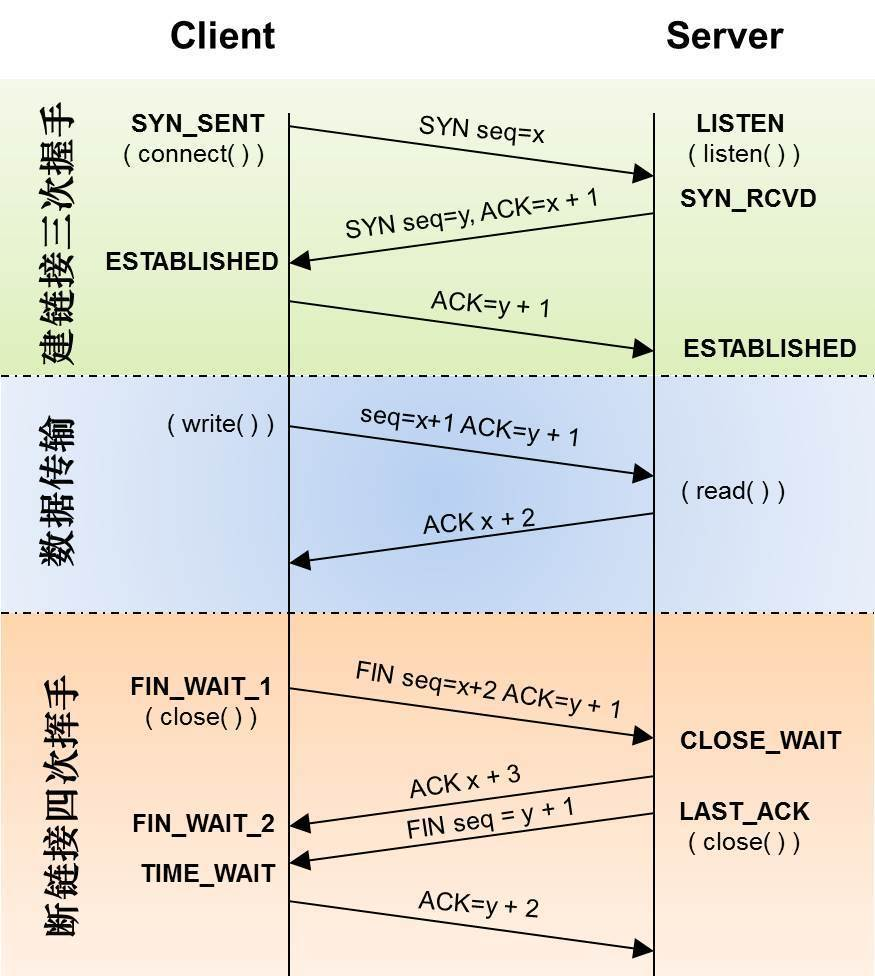

# HTTP 三次握手和四次挥手

## 基本介绍

HTTP: 超文本传输协议(Hyper Text Transfer Protocol) -> 建立在 TCP/IP 上层

http 协议是 web 联网的基础, 它是建立在 TCP 协议之上的一种应用, http 的显著特点是每次请求，服务器都必须响应，在请求结束后，连接就会释放。从建立连接到关闭连接的过程被称为"一次链接"

- http1.0 版本每次请求，都会建立一个连接，请求完成后就会释放连接
- http1.1 接入[keep-alive](./http-keep-alive.md)机制，一个连接可以发送可以请求, 多个请求可以重叠发送，不用等待一个连接完成后再发送

Socket: 套接字协议,可以自由选择 TCP/UDP 协议，一般都是成对出现，一个作为 ServerSocket 用来接收客户端传递信息， 一个作为
ClientSocket,用来传递信息

Socket 协议是通信的基石，是支持 tcp/ip 协议的网络通信的基本单元，socket 是互联网通信端点抽象表示, 包含了通信必须 5 中信息:
- 连接协议，
- 本地主机 IP 地址，
- 本地进程协议端口，
- 远程主机的 ip 端口，
- 远程进程的协议端口

socket 分为三个过程:

- 服务器监听
- 客户端连接
- 确认连接

TCP: 传输控制协议(Transfer Control Protocol) UDP: 用户数据协议(User Data Protocol)

## ISO 网络协议分层以及协议:

- 7 -> 应用层 -> HTTP、FTP、SMTP、DSN、TELNET
- 6 -> 表示层 -> 无
- 5 -> 会话层 -> 无
- 4 -> 传输层 -> TCP、UDP
- 3 -> 网络层 -> IP、ICMP
- 2 -> 数据链路层 -> ARP,PPP
- 1 -> 物理层 -> ISO2110

## 三次握手

### 使用三次握手基本状态位

SYN: (synchronous)同步状态位 ACK: (acknowledgement) 确认状态位 RST: (reset) 重置状态位 URG: (urgent) 紧急状态位

Sequence number: 序列号码 Acknowledgement number: 确认号码

### 三次握手过程

- 第一次握手: 客户端设置 Sequence number = x , 发送 SYN 报文 给服务器, 客户端进入 SYN_SEND 状态
- 第二次握手: 服务端接收到客户端发送信息, 然后设置 Sequence number = x + 1, Acknowledgement number = y, 通过给客户端发送
  一个报文段 ACK+SYN 报文段后 同时进入 SYN_RECV 状态
- 第三次握手: 客户端接收到服务器发送内容, 设置 Acknowledgement number = y + 1 发送 ACK 报文段给服务器，发送完毕后客户端
  和服务器都进入 ESTABLISHED 状态

上面就完成三次握手，三次握手必要性在于: 要在不可靠信道传输可靠信息，三次握手是通信交互的最小值。意义: 解决网络中大量的重
复分组，减少服务器资源的浪费

### 四次分手

- 第一次分手: 主机 1 设置 Sequence number， , 然后发送 FIN 报文给服务器， 此刻主机 1 进入 FIN_WAIT_1 状态
- 第二次分手: 主机 2 收到主机 1 发送的 FIN 报文后，向主机 1 回复一个 ACK 报文，同时设置 Acknowledgement number = seq
  number + 1, 然后主机 1 进入 FIN_WAIT_2
- 第三次分手: 主机 2 发送 FIN 报文给主机 1, 请求关闭连接, 同时主机进入 LAST_ACK 状态
- 第四次分手: 主机 1 收到 主机 2 的 FIN 报文， 向主机 2 发送 ACK 报文， 主机 1 进入 TIME_WAIT 状态, 主机 2 在收到 ACK 报
  文后，就会关闭连接，主机 1 在在等待 2MSL(maximum segment lifetime) -> 即两倍最大报文生命周期 没有收到回复就证明主机 2 已经关闭，然后主机 1 也会关闭

> 学习: https://github.com/jawil/blog/issues/14
