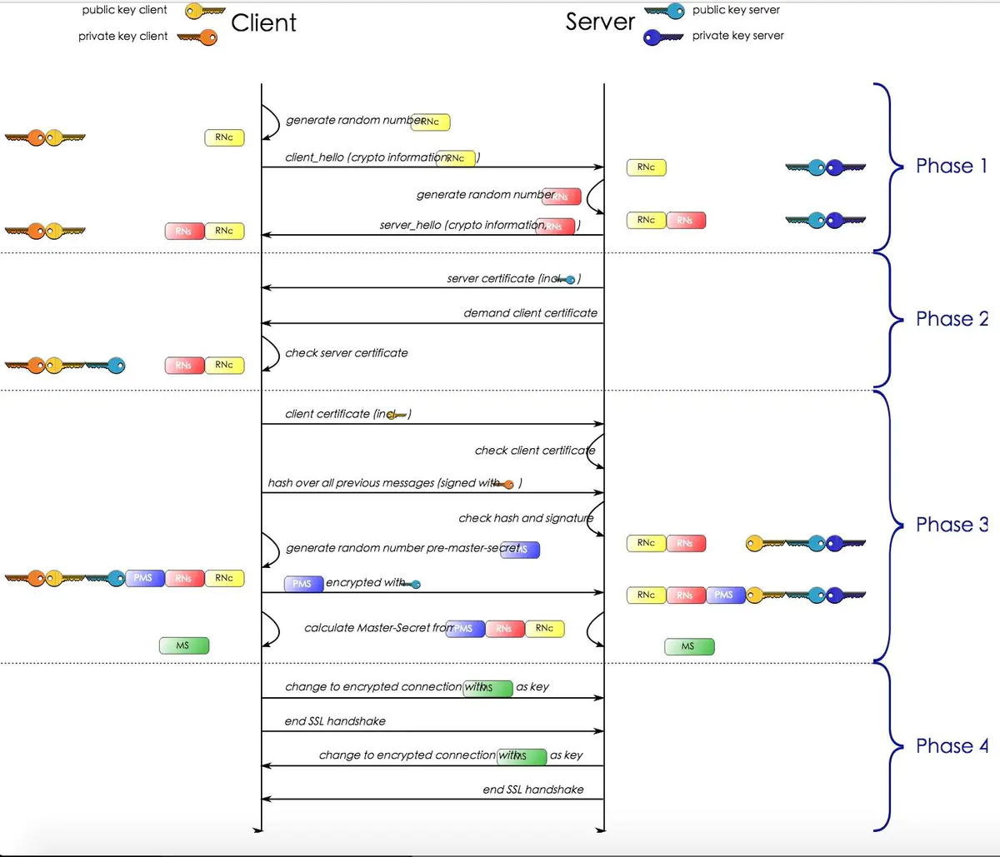

# HTTPS 握手过程

## 前言

HTTPS = HTTP + SSL/TLS 一个 https 协议是有 http 协议+ssl/tls 协议组成的

## SSL/TLS

SSL: security sockets layer， 安全套接字层协议 TLS: transfer layer security, 传输层安全协议, ssl 是其前身

## 握手过程

### 第一阶段: 协商基本信息

1. ClientHello: 客户端发送 `Client Hello` 信息, 信息内包含 ssl 协议版本，支持的加密套件(Cipher suite), 客户端随机生成的
   随机 1 `Random1`
2. ServerHello: 服务端收到信息后，给客户端发送 `Server Hello` 信息, 信息包含: 从客户端支持的加密套件中选取一种加密方式，
   服务器生成的随机 2 `Random2`

### 第二阶段: 校验服务端证书

3. Certificate: 服务器下发证书给客户端, 客户端来验证服务端身份，并取出`公钥`
4. Server Key Exchange: 如果使用 DH 算法，需要交换发送服务端使用 DH 参数。对于 RSA 则不需要
5. Certificate Request: 服务端可以要求客户端上传证书，这一步是可选的
6. Server Hello Done: 从这一步服务端通知客户端 Server Hello 过程结束。

### 第三阶段: 生成 PreMasterKey

7. Certificate Verify: 客户端收到服务器下发的证书后，去 CA(证书验证服务商)哪里校验证书是否有效, 有效的情况取出证书公钥，
   然后服务器会在生成一个随机数 3 `Random3`， 然后通过证书公钥对 `Random3`加密， 生成 PreMasterKey 8: Client Key
8. Exchange: 客户端会把 PreMasterKey 传递给服务器， 服务器使用证书私钥解通过 PreMasterKey 获取得到 `Random3`, 从这一步开
   始，服务器和客户端都拥有了 `Random1 + Random2 + Random3`。客户端和服务器依据相同的算法，通过三个数据数得到一个新的密
   钥。
   > PS：使用三个随机数的原因是因为 ssl/tls 在握手过程中数据都是明文传递的，使用多个随机数种子来生成密钥不容易被暴力破解

### 第四阶段: 通知结束 SSL

9. Change Cipher Spec(client): 客户端通知服务器接下来信息全部使用上面生成密钥来加密
10. Encrypted Handshake Message(client): 客户端把之前握手过程信息摘要通过新的密钥来加密然后发送给服务器，如果服务器能够
    正确解密信息则表示密钥一致。这是客户端发送的第一条加密信息
11. Change Cipher Spec: 服务器通知客户端接下来信息全部使用上面生成密钥来加密
12. Encrypted Handshake Message(server): 服务端把握手过程信息再要通过新的密钥加密发送给客户端，如果客户端能够解密信息，
    则表示密钥一直.这是服务器发送的第一条加密信息

到这里，客户端和服务端协商出来同一份密钥，后续信息都会通过该密钥加密，然后通过TCP进行可靠传输。

## 握手优化

- 通过 SessionID，下次 ssl 握手时候，若携带 sessionID，则复用之前过程，不再重新握手
- False Start: 在握手时候就一次把数据都传递过去
