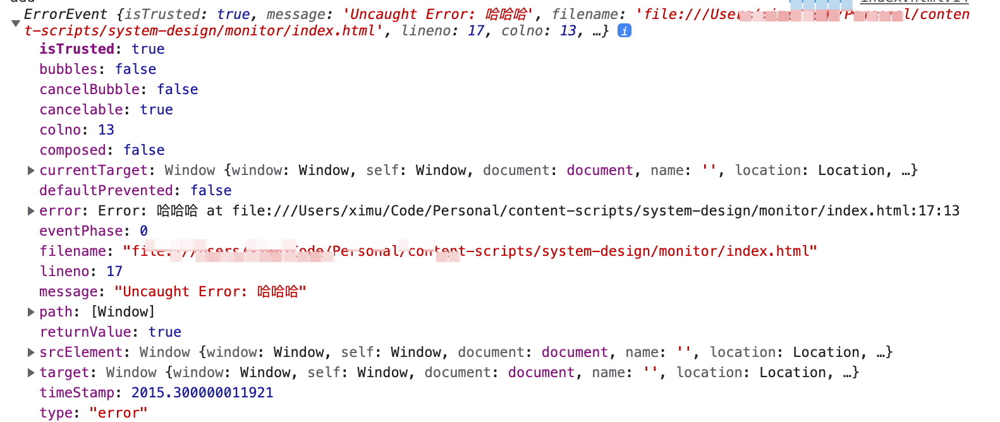

# 监控设计

## 监控基本设计

### 前端异常类型

- 图片加载异常
- 脚本加载失败
- promise 异常
- 运行时异常

### 捕获异常

前端监控异常的方式：

```js
window.onerror = function () {};

// error 事件不支持冒泡，所以需要在捕获的过程中抓住
window.addEventListener("error", function () {}, true);

window.addEventListener("unhandledrejection", function () {});
```

onerror/addEventListener('error'): 两种错误监听信息中都包含的错误的信息、文件、行号、列号。相对来说更推荐使用 `addEventListener`。onerror 因为历史原因兼容 ie6-8 所以一直存在. ErrorEvent 如下: 

### 具体的捕获类型错误处理

普通类型监听如下
```js
window.addEventListener(
  "error",
  (e) => {
    if (e.target instanceof HTMLScriptElement) {
      console.log("脚本错误", e.target.src);
      return;
    }
    if (e.target instanceof HTMLLinkElement) {
      console.log("资源加载问题", e.target.href);
      return;
    }
    if (e.target instanceof HTMLImageElement) {
      console.log("图片加载有问题", e.target.src);
      return;
    }
    // 脚本错误
    console.log("运行错误", e.error);
  },
  true
);
```
Promise的错误监听
```js
window.addEventListener('unhandledrejection', function() {})
```
